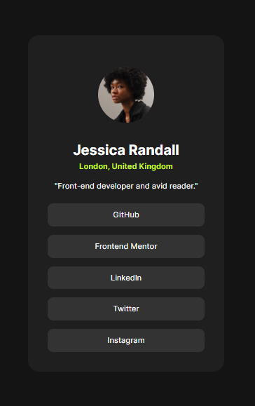

# Frontend Mentor - Social links profile solution

This is a solution to the [Social links profile challenge on Frontend Mentor](https://www.frontendmentor.io/challenges/social-links-profile-UG32l9m6dQ). Frontend Mentor challenges help you improve your coding skills by building realistic projects.

## Table of contents

-   [Overview](#overview)
    -   [The challenge](#the-challenge)
    -   [Result](#result)
    -   [Links](#links)
-   [My process](#my-process)
    -   [Built with](#built-with)
    -   [What I learned](#what-i-learned)
-   [Author](#author)

## Overview

### The challenge

Users should be able to:

-   See hover and focus states for all interactive elements on the page

### Result

Here is the final result of the page.

### Links

-   Live Site URL: [Add live site URL here](https://cigc151.github.io/frontend-mentor-social-links-profile/)

## My process

### Built with

-   Semantic HTML5
-   CSS custom properties
-   CSS Grid
-   Media Queries
-   BEM
-   Mobile-first workflow

### What I learned

-   Reset Default properties using normalize css.

-   Import and use font family from Google fonts.

-   Adding stylesheets to html pages.

-   CSS selectors, and pseudo-classes.

-   Mobile First Approach.

-   Using BEM methodology.

-   CSS Variables.

## Author

-   Frontend Mentor - [@cigc151](https://www.frontendmentor.io/profile/cigc151)
